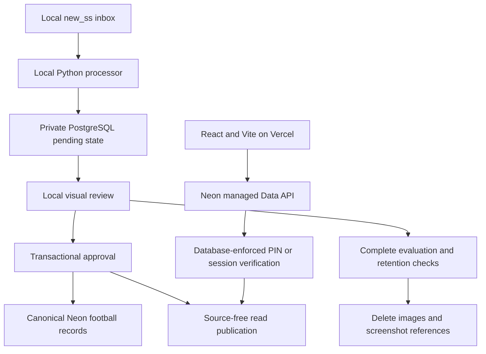

# Career Dashboard: Cloud Migration and Implementation Plan

Last consolidated: 2026-09-11.

Status: planning handoff, not an implementation record.

This document consolidates the architecture discussion into one current plan for future prompts and implementation agents. It intentionally separates confirmed requirements, recommended implementation details, unresolved decisions, and historical alternatives. Do not execute an older Supabase or custom-server proposal simply because it appeared earlier in the conversation.

The action authorized when this document was created was to prepare, commit, and push this document only. Its existence does not authorize provisioning services, applying database migrations, deleting screenshots, implementing authentication, changing application code, or deploying the application. Those actions require a subsequent implementation request and the verification gates below.

## Contents

1. [Current Decision Summary](#1-current-decision-summary)
2. [Why the Architecture Changed](#2-why-the-architecture-changed)
3. [What Exists Today](#3-what-exists-today)
4. [Target Architecture](#4-target-architecture)
5. [Hosting, Cost, and Configuration](#5-hosting-cost-and-configuration)
6. [PIN Authentication and the Feasibility Gate](#6-pin-authentication-and-the-feasibility-gate)
7. [Data Invariants](#7-data-invariants)
8. [PostgreSQL Schema and Persistence](#8-postgresql-schema-and-persistence)
9. [SQLite Migration and Cutover](#9-sqlite-migration-and-cutover)
10. [Local Screenshot Processing](#10-local-screenshot-processing)
11. [Review, Approval, and Corrections](#11-review-approval-and-corrections)
12. [Source-Free Dashboard Publications](#12-source-free-dashboard-publications)
13. [Frontend Changes](#13-frontend-changes)
14. [Screenshot and Reference Retirement](#14-screenshot-and-reference-retirement)
15. [Backups and Recovery](#15-backups-and-recovery)
16. [GitHub Actions and Future Uploads](#16-github-actions-and-future-uploads)
17. [Implementation Work Packages](#17-implementation-work-packages)
18. [File Ownership and Proposed Structure](#18-file-ownership-and-proposed-structure)
19. [Verification Matrix](#19-verification-matrix)
20. [Deployment and Operational Runbook](#20-deployment-and-operational-runbook)
21. [Open Decisions and Stop Conditions](#21-open-decisions-and-stop-conditions)
22. [Prompts for Future Agents](#22-prompts-for-future-agents)
23. [Definition of Done](#23-definition-of-done)
24. [References and Research Limitations](#24-references-and-research-limitations)

## 1. Current Decision Summary

### 1.1 Confirmed Requirements

| Topic                      | Current requirement                                                                                                                             |
| -------------------------- | ----------------------------------------------------------------------------------------------------------------------------------------------- |
| Frontend                   | Preserve the existing React/Vite application and its design.                                                                                    |
| Frontend hosting           | Vercel Hobby, serving the compiled static application.                                                                                          |
| Database                   | Neon PostgreSQL, preferably connected through Vercel Marketplace.                                                                               |
| Budget                     | Completely free within actual free-plan allowances. No paid upgrades, paid trials, paid add-ons, or metered infrastructure introduced silently. |
| Production authority       | PostgreSQL replaces writable SQLite after a verified migration.                                                                                 |
| Processing                 | Reuse the existing Python pipeline locally.                                                                                                     |
| Main workflow              | An eventual `./run process` command reads a `new_ss/` inbox.                                                                                    |
| Review                     | Every new extraction requires visual review initially.                                                                                          |
| Publication                | Approved records become visible on a website refresh without a Git push or frontend rebuild.                                                    |
| Screenshot retention       | Images and their screenshot-specific references are temporary, not a permanent archive.                                                         |
| Permanent information      | Football records, their stable UUID relationships, and a compact screenshot-free record-change history.                                         |
| Privacy                    | The website's data must be private, including direct requests that bypass the React UI.                                                         |
| Login preference           | Very basic authentication using a short numeric PIN configured in a private database table.                                                     |
| Additional servers         | No separately deployed Express/FastAPI server or custom Vercel API service by default.                                                          |
| GitHub Actions processing  | A possible later option, explicitly described by the user as MAYBE.                                                                             |
| Existing Supabase projects | Leave them untouched. The user already uses both available Free project slots.                                                                  |

The user has reported obtaining a Neon PostgreSQL connection string. Its value, role, target branch, saved location, and connectivity have not been inspected or verified during this planning work. A credential being available is not evidence that the database schema, Data API, authentication, or website is already configured.

### 1.2 Recommendations That Are Not Yet Proven or Fully Approved

- Use Neon's managed Data API as the browser transport, avoiding an additional application server.
- Verify the PIN on the database side, never by downloading its value or hash into React.
- Prefer at least a six-digit PIN. The user requested a short numeric PIN, but its exact length is not confirmed.
- Use a finite, configurable evidence grace period. Thirty days was proposed; it is not a permanently fixed requirement.
- Use a small immutable, source-free read publication to keep the dashboard's many tables consistent across network requests.
- Keep only the active and previous read publication, subject to measured storage cost.
- Start with one local processor and sequential OCR, rather than a distributed queue.
- Do not add a Neon keep-alive merely to prevent normal idle suspension. Neon automatically wakes on a new query.

These recommendations should be confirmed or tested at the owning work package, not silently expanded into a larger platform.

### 1.3 The Important Unresolved Issue

The no-extra-server, short-PIN authentication route is not yet proven on the selected Neon project.

The user asked for an explanation before accepting database-function verification through the managed Data API. Neon's current documentation is also inconsistent about requests made before user login: one page describes requests without an Authorization header, while another says anonymous access still uses an anonymous JWT.

Therefore, the first cloud integration experiment must establish whether the chosen project can securely support the intended pre-login PIN verification path. A small synthetic test may prove the route works, identify a required anonymous-token bootstrap, or demonstrate that a different approved auth approach is necessary.

This uncertainty blocks private production launch. It does not prevent safe local refactoring, synthetic frontend work, or migration preparation.

### 1.4 How to Read This Plan

Use [DATA_PROCESS.md](DATA_PROCESS.md) for the existing extraction facts, reviewed-data checkpoints, and domain rules. Use this document for the new target architecture and the explicitly revised retention policy.

Until implementation passes its gates, the existing SQLite database remains the actual authority. A plan to migrate does not make that database disposable. Likewise, the new retention goal does not authorize deleting partly evaluated images.

For future work, read the current code before editing it. Names of proposed modules and commands in this document are contracts to implement, not claims that those files or commands already exist.

## 2. Why the Architecture Changed

### 2.1 The Original Problem

The project currently couples data collection, local SQLite state, Git history, build-time exports, and a static website. This has several practical consequences:

- A mutable SQLite file is awkward to collaborate on or distribute through Git. Binary changes cannot be merged like ordinary source code.
- Database changes become entangled with code commits and deployment activity.
- The website only sees data included in its generated static export.
- Screenshot previews and source metadata are republished with the frontend.
- A growing image archive can consume much more storage than the extracted football records.
- Moving the current SQLite file onto an ephemeral hosting filesystem would not provide durable cloud writes.

SQLite itself is not inherently a bad database. The issue is that a shared, cloud-backed, privately accessible dashboard with ongoing imports needs a clearer separation between source code, canonical records, temporary input files, and deployment artifacts.

### 2.2 The Initial Full-Stack Idea

The initial desired experience was browser uploads, background extraction, review, and automatic dashboard updates. An Express server, a React/Vite website, and a free PostgreSQL service were considered.

That experience remains a possible future direction, but it introduces file storage, authenticated uploads, job durability, worker execution, and failure recovery. Hosting the frontend or an HTTP function does not automatically supply a reliable long-running OCR worker.

The user then confirmed that processing on their Mac is acceptable. That changes the smallest useful solution substantially: the existing Python pipeline can perform the expensive work, while the cloud stores approved records and serves the dashboard.

### 2.3 Alternatives and Their Status

| Alternative                           | Why it was considered                                                     | Current status                                                                                                       |
| ------------------------------------- | ------------------------------------------------------------------------- | -------------------------------------------------------------------------------------------------------------------- |
| Supabase Free                         | PostgreSQL, managed Data API, Auth, and optional Storage in one platform. | Not selected because the user's two Free project slots are already occupied.                                         |
| Supabase through Vercel Marketplace   | Integrated setup and environment-variable synchronization.                | Valid integration, but it does not solve the user's exhausted Supabase allowance.                                    |
| Neon Free through Vercel Marketplace  | Independent free allowance and standard PostgreSQL.                       | Selected database direction.                                                                                         |
| Express or FastAPI on Vercel          | A small custom API could mediate reads and authentication.                | Not selected by default; the user wants no extra API service.                                                        |
| Cloud Run plus a durable task service | Can host containerized Python processing.                                 | Rejected for the first release because billing-enabled metered services conflict with the strict-free constraint.    |
| Render Free                           | A familiar web-service deployment model.                                  | Not chosen as lasting storage or a background worker; the researched Free PostgreSQL offering expires after 30 days. |
| GitHub Actions processing             | Can execute the existing Python commands in a hosted batch job.           | Optional future investigation, not an implementation dependency.                                                     |
| Git LFS for SQLite/images             | Could change how large binary files are stored in Git.                    | Does not solve live database authority, transactional cloud writes, or the retention requirement.                    |
| Permanent private screenshot storage  | Preserves unlimited future visual re-audits.                              | Explicitly rejected by the user.                                                                                     |

Do not reintroduce one of these alternatives without explaining the reason and obtaining approval when it changes an explicit constraint.

### 2.4 Keep-Alive History Must Not Be Misread

While Supabase was selected, the user explicitly requested a keep-alive GitHub Actions workflow. The proposed design was a daily read-only check at 04:23 UTC, with a manual trigger and no privileged database key.

Neon's normal scale-to-zero behavior is different: compute sleeps after inactivity and wakes automatically on the next query. A keep-alive is not needed for that behavior, and repeated pings consume some free compute.

The recommendation after switching providers was to omit the Supabase-specific workflow. The earlier operational request should still be acknowledged, not forgotten. Before implementing a workflow, confirm whether the user now wants no workflow or a separate low-frequency availability monitor. Do not create a Supabase workflow pointing at either of their unrelated projects, and do not claim a monitor guarantees an always-warm Neon Free database.

## 3. What Exists Today

### 3.1 Current Data Path

```text
Original screenshots
    -> Python inventory and OCR
    -> SQLite candidates and review history
    -> explicit visual review and approval
    -> canonical SQLite records
    -> generated JSON export and WebP previews
    -> static React/Vite dashboard
```

The current website does not connect to SQLite from the browser. Python exports the data, and the browser fetches that exported JSON.

No cloud migration, PIN-auth system, cloud API integration, or keep-alive workflow was implemented during the architecture discussion.

### 3.2 Important Existing Files

| Existing file                                                  | Ownership and relevance                                                                                    |
| -------------------------------------------------------------- | ---------------------------------------------------------------------------------------------------------- |
| [run](run)                                                     | POSIX-shell frontend command launcher; extend this rather than creating competing launchers.               |
| [requirements.txt](requirements.txt)                           | Existing local image/OCR dependencies.                                                                     |
| [career_data/database.py](career_data/database.py)             | SQLite connection, inventory, integrity checks, and coverage reporting.                                    |
| [career_data/pipeline.py](career_data/pipeline.py)             | Extraction staging, review generation, canonical import, approval transactions, export, and SQLite backup. |
| [career_data/extraction.py](career_data/extraction.py)         | Layout-aware screenshot classification and RapidOCR extraction.                                            |
| [career_data/identifiers.py](career_data/identifiers.py)       | UUID rules and explicit legacy-ID translation.                                                             |
| [career_data/schema.sql](career_data/schema.sql)               | Existing SQLite schema, constraints, source links, and participation triggers.                             |
| [career_data/migrations.py](career_data/migrations.py)         | Historical SQLite UUID migration with recovery safeguards.                                                 |
| [career_data/reconciliation.py](career_data/reconciliation.py) | Scoped comparisons between captured cumulative totals and derived match records.                           |
| [career_data/batch_review.py](career_data/batch_review.py)     | Batch preparation and fixture-context proposals.                                                           |
| [career_data/review_images.py](career_data/review_images.py)   | Local contact sheets for visual checks.                                                                    |
| [career_data/**main**.py](career_data/__main__.py)             | Current Python CLI.                                                                                        |
| [web/scripts/sync_data.py](web/scripts/sync_data.py)           | Exports SQLite into the public website directory and generates screenshot previews.                        |
| [web/src/App.tsx](web/src/App.tsx)                             | Static dataset loading, shell, routing, filters, and source-modal wiring.                                  |
| [web/src/data.ts](web/src/data.ts)                             | Dataset contract, `createModel`, indexing, and data calculations.                                          |
| [web/src/pages.tsx](web/src/pages.tsx)                         | Main dashboard, fixture, and player surfaces, including source controls.                                   |
| [web/src/archive.tsx](web/src/archive.tsx)                     | Career records, reconciliation, raw-data explorer, and image archive.                                      |
| [web/src/ui.tsx](web/src/ui.tsx)                               | Shared UI, including screenshot buttons, images, and modal.                                                |
| [web/src/context.ts](web/src/context.ts)                       | Shared model and source-opening context.                                                                   |
| [web/vite.config.ts](web/vite.config.ts)                       | Vite configuration and development-only original-image middleware.                                         |
| [web/package.json](web/package.json)                           | Build hooks, frontend scripts, and dependency versions.                                                    |
| [web/README.md](web/README.md)                                 | Existing website operation instructions.                                                                   |

### 3.3 Local Behaviors That Matter to the Migration

`inventory` currently scans the legacy image directory and resets all `source_paths.present` flags before scanning. That is a full-archive inventory operation, not a safe incremental-inbox implementation. Scanning a new batch must not make unrelated historical files appear missing.

`select_sources` currently relies on numeric screenshot sequence and present paths. Future batches need stable batch/item/source UUIDs because filenames and numbering can repeat across sessions.

`extract_pending` checks the file hash before extraction, lazily loads OCR, and updates candidate data without overwriting approved canonical values. Preserve those guarantees.

`make_review` prefers the latest reviewed payload when one exists. Regenerating machine candidates must not silently discard human corrections or replace an edited review file.

`checked_values` reads SQLite field types through `PRAGMA table_info`. The PostgreSQL port needs explicit supported field/type metadata, not permissive acceptance of arbitrary fields.

`merge_record` uses SQLite-specific null-safe matching and refuses to overwrite a reviewed non-null value unless an intentional correction is authorized.

`confirmed_match` requires a verified match UUID or a source that resolves to exactly one approved match. Filename adjacency is not a substitute.

`approve_review` wraps the entire review document in one transaction. A late invalid source rolls back earlier inserts. Replaying an identical ordinary review skips it without creating another revision. Explicit corrections have separate revision/hash behavior.

`export_data` is a viewer-oriented export that also contains source information. It is neither a suitable private-browser contract as-is nor a complete backup of all database state.

### 3.4 Documented Data Checkpoint

The following is the checkpoint documented during the earlier extraction work, not a fresh database measurement performed for this plan:

| Item                                               | Documented count |
| -------------------------------------------------- | ---------------: |
| Inventoried screenshots                            |            1,296 |
| Canonical fixtures                                 |               85 |
| Preseason fixtures                                 |               10 |
| Team-match rows                                    |              170 |
| Player-match appearances                           |            1,132 |
| Notts County appearances                           |            1,131 |
| Player snapshots                                   |            1,152 |
| Captured cumulative competition/total observations |              120 |

Future migration preflight must establish current counts and digests. Do not force current data to equal this table if more records have been legitimately reviewed since the checkpoint.

### 3.5 Incomplete Extraction Is Still Incomplete

Detailed passing/defending fields outside reviewed pilots, complete opening squad/roster groups, some transfer/news/result data, and partial standings still require work. The migration is not an instruction to invent or complete those values.

An image can have correctly imported core records while still containing unreviewed visible content. Such an image is not automatically eligible for deletion.

## 4. Target Architecture

### 4.1 Logical Components



The PIN/session path in this diagram is the intended trust boundary. Its exact transport and database functions are conditional on the feasibility work in Section 6.

### 4.2 What Runs Where

| Component              | Location                         | Responsibility                                                                               |
| ---------------------- | -------------------------------- | -------------------------------------------------------------------------------------------- |
| React/Vite             | Static files on Vercel           | Display approved data, filters, navigation, and PIN entry.                                   |
| Managed Data API       | Neon                             | HTTP transport into explicitly permitted database operations.                                |
| PostgreSQL             | Neon                             | Canonical records, temporary pending state, access controls, and read publications.          |
| Python processor       | Owner's Mac                      | Inventory, OCR, review preparation, validation, approval, backup, and cleanup.               |
| Optional future runner | GitHub Actions, only if selected | Run the same batch-processing commands with explicit input transfer and limited credentials. |

No local image bytes are needed by the normal website. No local machine must stay on merely for a visitor to read already approved records.

The Mac must be running to perform local processing. If processing is stopped, the website continues to display the latest approved publication rather than claiming that queued work is finished.

### 4.3 Authority Boundaries

- Git stores source code, migrations, documentation, and small synthetic fixtures.
- Neon stores the authoritative reviewed football data after cutover.
- Local manifests and candidate checkpoints support recovery but are not a competing canonical database.
- A read publication is rebuildable from canonical records. It is not a second writable source of truth.
- The PIN grants viewer access only. It must not grant database administration, screenshot approval, migration, or deletion privileges.
- A cloud database outage must not cause the CLI to silently create or start writing a replacement SQLite database.

### 4.4 What Is Not Part of the First Release

- A new frontend framework or redesign.
- A deployed Express/FastAPI application.
- Paid cloud OCR or model inference.
- Automatic approval based on OCR confidence.
- A browser upload screen or cloud screenshot bucket.
- An always-on worker, Redis, Celery, or general-purpose queue framework.
- A multi-user role-management product.
- A permanent screenshot audit archive.
- An automatic database migration on every frontend build.

## 5. Hosting, Cost, and Configuration

### 5.1 Free-Plan Assumptions

The official Neon pricing page researched on 2026-09-11 advertised a Free plan with 100 projects, 0.5 GB storage per project, 100 CU-hours per project per month, and 5 GB included public network transfer. These are researched allowances, not contractual promises embedded in the application.

Before provisioning, confirm the actual plan offered to the user's account and the Marketplace installation summary. The user does not authorize a paid fallback if the free installation is unavailable.

Neon's managed Data API and Managed Better Auth were documented as beta during research. The Data API is relevant to the selected architecture. Managed Better Auth is not automatically selected just because it is available; the user prefers a table-backed PIN.

Normal Neon idle suspension is not data deletion. Compute wakes on a subsequent query, potentially adding a small cold-start delay. Exhausting a quota or hitting an account restriction is a different situation; a keep-alive cannot solve it.

### 5.2 Measure Storage Before Migration

The actual PostgreSQL footprint includes tables, indexes, JSON/TOAST storage, temporary OCR state, audit entries, and retained read publications. Do not infer this total from the SQLite file size alone.

Recommended warning levels are 80% of the free storage allowance and a pause on new bulk intake near 90%. These are application guardrails to review, not provider limits. A warning must not automatically delete unreviewed data or upgrade the account.

Images generally dominate file-storage costs, but retained OCR JSON and repeated full publications can also grow. Measure rather than assuming that removing screenshot bytes alone fixes every capacity issue.

### 5.3 Credentials and Public Configuration

| Name                       | Consumer                                  | Sensitivity and meaning                                                                 |
| -------------------------- | ----------------------------------------- | --------------------------------------------------------------------------------------- |
| `DATABASE_URL`             | Local Python                              | Private PostgreSQL connection string for the explicitly configured local role.          |
| `DATABASE_URL_UNPOOLED`    | Local migration/backup tools, when needed | Private direct connection, particularly for session-oriented operations.                |
| `CAREER_TEST_DATABASE_URL` | Integration tests                         | Private disposable test target; never silently fall back to production.                 |
| `CAREER_DATA_HOME`         | Local processor                           | Directory for temporary sources, reviews, manifests, and protected backups outside Git. |
| `VITE_NEON_DATA_API_URL`   | Browser                                   | Credential-free HTTPS Data API endpoint, not a PostgreSQL connection string.            |
| PIN                        | User entry and trusted verifier           | Secret entered privately; never a build-time `VITE_` variable.                          |

A direct local PostgreSQL URL can be sufficient initially. Do not require two connection strings merely for symmetry if the single direct connection already serves the workflow. If the provided connection is pooled, obtain and test the direct counterpart for migrations and backups where session behavior matters.

Every Vite variable beginning with `VITE_` is potentially included in browser code. `VITE_PUBLIC_` is not a stronger privacy mechanism; it is still public. Never rename a PostgreSQL connection string to a `VITE_` variable.

Some Neon SDK versions use a credential-free HTTPS variable named `VITE_NEON_DATABASE_URL` to derive Auth/Data API endpoints. That name is easy to confuse with a private DSN. Prefer the explicit Data API URL contract here unless a verified SDK integration requires otherwise, and document any change precisely.

### 5.4 Handling Secrets Safely

- The owner should enter credentials directly into their local editor, terminal, or provider secret configuration, not paste them into an agent conversation.
- Create ignore rules before storing real local environment files.
- Do not print connection strings, PINs, PIN hashes, session tokens, management keys, or complete request headers in logs.
- Do not put secrets in URLs, command examples, screenshots, fixtures, job summaries, or workflow inputs.
- Keep the role used for schema administration separate from ordinary processing credentials where practical.
- A frontend deployment should not need an elevated Neon credential at runtime or build time.
- If Marketplace injects private variables, never spread all environment variables into the Vite configuration or widen its public prefix.

### 5.5 Vercel Configuration When the Project Is Connected

The user intentionally deferred connecting the database to a Vercel project while collecting setup values. Do not interpret having a connection string as permission to connect or deploy automatically.

For the eventual static frontend project, use:

| Setting                                    | Intended value                                                                               |
| ------------------------------------------ | -------------------------------------------------------------------------------------------- |
| Root directory                             | `web`                                                                                        |
| Framework                                  | Vite                                                                                         |
| Install command                            | `npm ci`, once the existing lockfile is confirmed                                            |
| Build command                              | `npm run build`, after its local-data hooks are removed                                      |
| Output directory                           | `dist`                                                                                       |
| Public configuration                       | Credential-free Data API endpoint only, plus any explicitly approved transport configuration |
| Database variable prefix                   | Private `DATABASE`, not `VITE` or `VITE_PUBLIC`                                              |
| Automatic database branches per deployment | Disabled initially                                                                           |

Use a deliberate production database and a bounded dev/test target. Do not enable automatic preview branching without accounting for free branch limits and copies of data that might outlive screenshot retirement. Vercel deployment retention and database branch retention are not automatically the same as the project's desired evidence lifetime.

### 5.6 Local Toolchain Constraints

The existing project uses Python and Node/npm. Reuse these tools and the current OCR implementation.

On the owner's managed Mac, administrator installation and Homebrew-based setup may be unavailable. Prefer existing tools, a user-owned virtual environment, available binary wheels, a user-local PostgreSQL client, or an explicitly available container runtime. Do not issue interactive privilege-escalation commands or disable TLS verification to bypass corporate network issues.

Use a project-local public npm registry configuration if the corporate registry blocks required public packages; do not rewrite global package-manager settings for unrelated projects. Avoid introducing Prisma's native engine dependency into a workflow that already has straightforward Python PostgreSQL access.

## 6. PIN Authentication and the Feasibility Gate

### 6.1 What the User Wants

The desired user experience is a small PIN entry screen for a private site, with the configured PIN represented in a database table. There is no requirement for public signup, email login, social login, multiple accounts, or an authentication dashboard.

The user explicitly prefers a short numeric PIN over a long generated passphrase. This is a usability decision with security consequences that the implementation must account for.

The exact secure implementation was not approved during the discussion. When asked whether a database function through Neon's existing Data API was acceptable, the user requested the distinction be explained first. Preserve this decision boundary.

### 6.2 The Insecure Design to Avoid

Do not implement the following pattern:

```text
React fetches a PIN or PIN hash from a table
    -> React compares the entered value
    -> React sets unlocked = true
    -> React reads otherwise publicly available career tables
```

Anyone can bypass a browser-only condition and request the data endpoint directly. A hash downloaded to the client also exposes a low-entropy PIN to offline guessing. A private-looking screen is not proof of private data.

CORS, an obscure URL, a private Git repository, and hiding the Data API key are not substitutes for authorization on the data-serving path.

### 6.3 The Intended Trust Boundary

The preferred direction is:

```text
User enters PIN
    -> trusted PostgreSQL verification through Neon's existing Data API
    -> verified read authorization
    -> only the source-free dashboard data is returned
```

There is still an HTTP API call. The distinction is that it uses the managed Data API rather than a separately deployed custom server. PostgreSQL functions exposed through that service are still backend logic and must be reviewed as security-sensitive code.

A function that only returns `true` for a correct PIN is insufficient if later data reads are unrestricted. Every protected data read must independently enforce the verified authorization or a valid, unexpired read session.

### 6.4 First Experiment: Prove the Managed Transport

Run a minimal experiment on a synthetic dev database before importing real records or committing to a final auth implementation:

1. Confirm the Neon branch, database, Free plan, and Data API availability.
2. Disable broad automatic schema grants when enabling the Data API.
3. Expose only a deliberately small test API schema.
4. Create one private synthetic value and one narrowly permissioned test function.
5. Verify how a pre-login browser request reaches the function: truly without a JWT, or through a provider-issued anonymous token.
6. Verify the caller cannot query the private value or security table directly.
7. Verify POST arguments, request metadata, response status/headers, and transaction behavior on the actual managed service.
8. Exercise denied calls, concurrent calls, wrong codes, missing parameters, and response parsing failures.
9. Record the observed behavior, SDK version, permissions, and limitations without credentials or tokens.

The documentation conflict must be resolved empirically on the intended service. Generic PostgREST behavior does not prove every hosted Neon setting is available.

If an anonymous-token bootstrap is required, explain that requirement to the user. Such a token only supplies transport identity and must not itself authorize viewing the career. Do not silently introduce a managed-login UI, another identity provider, or a custom token issuer.

If the intended secure route is unavailable, stop that work package and ask for an architectural decision. Do not make career tables public to preserve the appearance of simplicity.

### 6.5 Candidate Design After Approval

The following is a recommended design to evaluate, not an assertion that all functions already exist or that the user has approved the exact session mechanism.

Keep a private security configuration table with a UUID primary key, salted PIN hash, configured PIN length, enabled flag, revision, and bounded attempt/cooldown state. The table must not be exposed through the Data API.

Preserve PINs as strings so leading zeroes are meaningful. Validate exact length and numeric characters without converting the PIN to an integer. Recommend six or more digits; record the owner's actual choice before implementation.

Use an established password-hashing primitive, such as Neon-supported `pgcrypto` bcrypt with an appropriate measured cost, rather than plaintext, reversible encryption, or a fast unsalted digest. Never copy a low-cost documentation example as the production security parameter without evaluation.

Prefer verifying the PIN once to create a short-lived, read-only opaque session, instead of repeatedly computing a password hash for every publication part. If selected, session tokens should contain at least 256 bits of cryptographic randomness, be stored only as token hashes in the database, and have explicit expiry and revocation. A session row uses its own UUID; the bearer token is not an entity ID.

An illustrative database-function interface is:

```text
open_viewer_session(pin)
read_career_manifest(viewer_token)
read_career_part(viewer_token, publication_id, part_index)
close_viewer_session(viewer_token)
```

These names are proposed interfaces through the managed Data API, not new Vercel routes. If the chosen implementation uses a different verified transport, document that interface before frontend work depends on it.

Browser callers should receive only execution permission on approved functions, not direct reads of private tables. If security-definer functions are necessary, use dedicated non-login function-owner roles with minimum privileges, a fixed empty search path, fully qualified identifiers, bounded results, and no caller-controlled dynamic SQL. Revoke default `PUBLIC` execution and do not use the overall database owner as the routine's privilege boundary.

RLS and grants remain defense in depth. A shared-PIN route must not accidentally inherit a managed-auth `authenticated` role's broad access. Do not attach fictional `auth.uid()` ownership logic to a request that has no verified user identity.

### 6.6 Short PINs Require Real Attempt Controls

A four-digit numeric PIN has only 10,000 possibilities; a six-digit PIN has 1,000,000. Salted hashing protects the stored representation but does not make repeated online guesses safe.

The final design must specify and test:

- A database-enforced attempt window and cooldown, not a React timer.
- Concurrency-safe counters so parallel requests cannot each see an unexhausted allowance.
- A bounded global backstop if trusted per-client identity is unavailable.
- Whether the gateway exposes a trustworthy client address; a caller-supplied header is not automatically trustworthy.
- Generic denied responses that do not reveal configuration, the correct PIN length unexpectedly, or other private state.
- A local administrator recovery/reset path for lockout and PIN rotation.
- The denial-of-service trade-off of a shared global lockout: an attacker can attempt to lock out the legitimate viewer.
- Bounded session and attempt-state cleanup so the auth design does not create unlimited storage growth.
- PIN rotation invalidating existing viewer sessions as part of the intended policy.

An example policy such as five failures followed by a fifteen-minute cooldown is a candidate for review, not a confirmed setting. Exact values, session duration, and browser persistence remain open decisions.

### 6.7 Transaction and Gateway Pitfalls

PostgREST normally wraps each request in a transaction. Raising an exception after updating a failed-attempt counter can roll back the counter, making the apparent rate limit ineffective.

If attempt state is written during a verification function, verify that failure outcomes commit safely. A `POST` to an appropriately declared function may allow writes, whereas `GET`/`HEAD` and stable/read-only functions do not. Do not put mutating rate-limit logic inside an ordinary read-only RLS predicate.

Test the actual gateway against client-controlled rollback preferences, malformed response filters, cancellation, response errors, and concurrent attempts. A caller must not be able to obtain a useful PIN oracle while repeatedly rolling back the attempt accounting. If that cannot be made reliable with the supported managed API configuration, the short-PIN design needs a different approved trusted boundary.

Never log submitted PINs or session tokens. Use HTTPS POST bodies for sensitive parameters, not query strings. Do not allow a generic read endpoint to become a secret-bearing GET request merely because a library supports both methods.

### 6.8 Frontend Session Behavior

Recommended initial behavior is an in-memory viewer session, with re-entry after reload or expiry. This avoids persisting the PIN or career data in local storage. A remember-me option, if wanted, needs a separate explicit storage and threat-model decision.

On logout, expiry, failed authorization, or PIN rotation:

- Clear the loaded model and private page content.
- Cancel pending requests and ignore stale responses that arrive later.
- Remove the opaque token from the client state.
- Return to the PIN screen without exposing a cached dataset behind the overlay.
- Preserve non-sensitive navigation/filter state where useful, but never put the PIN/token into the URL.

This design does not magically produce HttpOnly cookies. Do not claim cookie properties that a browser-managed cross-origin token flow does not provide.

### 6.9 Launch Gate

No real career data may be published until tests show that a request made outside React, with missing or invalid authorization, cannot retrieve the dataset or the PIN table. Test the permitted path too; a system that denies everybody is not a completed login implementation.

## 7. Data Invariants

### 7.1 Identity and Relationships

- All application entity IDs and foreign-key references remain UUIDs.
- Content hashes are separate deduplication fields, not entity IDs.
- Revision numbers, ordering positions, measurement values, and other numeric metadata may remain integers.
- Preserve existing canonical player, club, season, competition, fixture, appearance, snapshot, transfer, and event UUIDs.
- Every match belongs to a competition edition and season.
- A player or team appearance must belong to a club participating in that match.
- Keep the existing alias-resolution rules. Do not fuzzy-merge players or change Unicode/casefold identity behavior during infrastructure work.
- A second career save would require explicit career scoping before mixing records. It is not part of this migration.

### 7.2 Statistical Meaning

- Missing values remain null, not zero.
- Unknown scores do not become draws.
- Penalty shootout scores remain separate from match goals.
- Keep displayed goalkeeper conceded values separate from normalized pre-shootout values and their basis.
- Do not invent own goals to make player credits equal a team score.
- Do not create appearances from squad screens.
- Season-start/end and other player snapshots remain distinct observations.
- Captured cumulative competition totals must not be added to match-level totals.
- Reconciliation must use the same club, season, competition scope, and cutoff.
- Preserve the established average-rating display/truncation rules and raw values.
- Do not invent minutes, substitution times, precise dates, or per-90 metrics from unsupported sources.

### 7.3 Known Regression Anchors

Retain the documented League Two 2018/19 result of 46 played and 83 points, the four reviewed goalkeeper adjustments, and the known Portsmouth match on 2019-10-09 where the verified team score and player goal credits differ.

These are regression anchors, not permission to coerce a newer dataset into stale totals. The precise baseline must be re-established from the reviewed database before migration.

### 7.4 Review Integrity

- Machine extraction never overwrites reviewed canonical values.
- Ordinary imports fill unknown values and reject conflicting known ones.
- Explicit corrections can change or clear values, with an audit entry.
- Entire review-document approval remains atomic.
- Identical ordinary review replay must not create another source revision.
- A partly approved source remains pending even if some of its records are already canonical.
- Infrastructure migration must not serve as an unreviewed identity correction.

## 8. PostgreSQL Schema and Persistence

### 8.1 Prefer an Explicit Port

Use a tested `psycopg` 3 distribution for the local Python path. Keep the existing Python domain functions as the owning implementation rather than rewriting approval/reconciliation in JavaScript.

Use explicit versioned PostgreSQL SQL migrations and one migration ledger. A small project-owned runner is sufficient if it handles checksums, ordering, transactions, and locking correctly. Do not create both a Supabase migration history and an independent Neon history for the same target.

Preserve [career_data/schema.sql](career_data/schema.sql) and [career_data/migrations.py](career_data/migrations.py) as historical SQLite migration references/fixtures where needed. Do not rewrite historical v1-v3 migrations to pretend PostgreSQL existed earlier.

### 8.2 Proposed Schema Boundaries

| Schema        | Contents                                                                                                      | Browser access                                                           |
| ------------- | ------------------------------------------------------------------------------------------------------------- | ------------------------------------------------------------------------ |
| `career`      | Canonical football tables, temporary ingestion state, source-free change audit, and read-publication storage. | No direct table access in the proposed PIN/RPC design.                   |
| `app_private` | PIN configuration, bounded attempt state, and optional viewer sessions.                                       | Never exposed.                                                           |
| `api`         | Only explicitly approved database functions serving the source-free viewer contract.                          | Narrow execution grants, conditional on the proven authorization design. |

The exact schema organization may be adjusted if an existing implementation provides a simpler equivalent boundary. Its security properties may not be weakened for convenience.

Neon-managed schemas are provider-owned. Do not write directly into managed authentication tables or assume Supabase's `auth.users` table exists.

### 8.3 Type Conversion

- Use native PostgreSQL UUID columns for application IDs.
- Use booleans for genuinely boolean fields while preserving nullability and review-document compatibility.
- Use suitable integer/bigint columns for counters, bytes, and integer money amounts.
- Preserve existing floating values with a compatible numeric representation; do not silently change rounding semantics.
- Convert valid dates and timestamps explicitly. Preserve date precision and uncertainty rather than filling missing dates.
- Keep enum-like strings as CHECK-constrained text initially unless there is a concrete reason for a new enum type.
- Preserve the exact stored text of historical review payloads and their hashes during migration.
- JSONB is useful for mutable candidates and structured state, but its reserialization must not be confused with the original byte serialization used by an audit hash.

Conversions must fail on invalid or ambiguous data rather than silently coerce it.

### 8.4 SQL and Driver Differences

Port the actual queries and their semantics, including:

- SQLite `?` placeholders to proper bound PostgreSQL parameters.
- `INSERT OR IGNORE` to an explicit conflict target and deliberate conflict behavior.
- SQLite null-safe `IS ?` comparisons to PostgreSQL's corresponding null-safe comparison.
- `PRAGMA` and `sqlite_master` usage to appropriate explicit metadata/integrity checks.
- Participation triggers to PostgreSQL trigger functions.
- SQLite collation/name behavior to the existing Python normalization contract.
- Tuple/index row access to one deliberate mapping-row convention.
- UUID/date/JSON values to stable application-facing representations at boundaries.

Do not create a regex SQL translator or a fake SQLite connection wrapper that masks dialect differences. Do not use caller-controlled table or column names; any dynamic identifiers come only from internal allowlists and safe identifier composition.

### 8.5 Source-Independent Identity

Several current import keys include `source_id`. That is acceptable while a source is retained, but it cannot be the permanent identity of a football observation after the user-requested purge.

The relevant canonical tables already have independent UUID primary keys. Preserve them. Make their source references nullable in a deliberate migration and ensure import/correction logic can target the canonical UUID independently.

Do not replace snapshot uniqueness with a broad key such as player, season, and snapshot kind. Multiple legitimate observations can share those values. Likewise, incomplete transfer dates and event periods are not safe automatic deduplication keys.

Where source-based uniqueness remains useful, constrain it to retained-source rows. A global nulls-not-distinct constraint involving a now-null source column can collapse or reject distinct detached observations. Test this explicitly.

### 8.6 Roles and Transactions

Keep schema administration, local import, auth verification, and viewer reads separate:

- Migration role: required schema privileges for explicit controlled changes.
- Import role: required application DML, no general account administration or DDL.
- Verification function owner: only the private security and session privileges necessary for the approved auth design.
- Read function owner: only the access needed to validate a viewer session and read sanitized publications.
- Browser/transport role: execution of approved functions only, not role escalation or private-table access.

For one career, a transaction-scoped writer lock can serialize canonical approvals, related corrections, and publication revision updates. Use source/operation revision checks as well. Do not hold that transaction while OCR runs or a human is reading a screenshot.

Use the direct/unpooled Neon endpoint for operations that need stable session behavior. Test the actual role, TLS verification, connection cleanup, and backup tooling; do not inherit Supabase-specific pooler host/port assumptions.

## 9. SQLite Migration and Cutover

### 9.1 Baseline First

Before changing actual data:

1. Record Git status and current code revision without discarding unrelated work.
2. Create a consistent SQLite backup using the existing backup facility and a new destination.
3. Open the migration source read-only. Do not use a helper that can initialize or upgrade it as a side effect.
4. Enumerate every application table, not just the export allowlist.
5. Capture counts, canonicalized row digests, UUIDs, relationships, aliases, legacy mappings, source states, review payloads/hashes/revisions, and reconciliation outputs.
6. Inspect pending review files so unapproved human edits are not mistaken for disposable generated output.
7. Measure data, OCR JSON, and expected PostgreSQL overhead against the actual Free quota.

The backup and manifest contain private material. Keep them outside Git and do not attach them to a public issue or agent prompt.

### 9.2 Copy All Necessary State

Initial migration must preserve canonical records and the pending pipeline state required to finish evaluation. This includes source inventory, source paths, extraction candidates/evidence/issues, source links, reviews, player/club aliases, and legacy ID mappings.

Do not rebuild the database by replaying OCR or only importing the website export. Either approach can lose reviewed decisions, history, aliases, or pending work.

Do not seed new default competitions on top of copied competition records. Preserve existing UUIDs instead of creating duplicates that happen to have the same names.

### 9.3 Transactional Copy and Reruns

Migrate into a new, explicitly selected application target. Provider-internal tables do not make the target invalid; unexpected existing application data does.

The migration records a source fingerprint and completion state. An identical completed rerun is a verified no-op. An unexpected nonempty destination or changed source requires a deliberate decision, not a truncate-and-reload shortcut.

Copy in dependency order with explicit type conversions and compare results before declaring success. Keep schema creation and row-copy responsibilities clear; do not leave a half-marked successful migration if a later validation fails.

### 9.4 Parity Checks

Required comparisons include:

- Row counts and UUID sets for every copied table.
- All required and optional foreign-key relationships.
- Alias and legacy-ID mapping values.
- Exact review payload text, hash values, and per-source revision order.
- Null versus zero behavior and boolean values.
- Competition/preseason classification and fixture identity.
- Snapshot scope, dates, and observed/derived totals.
- Coverage and reconciliation results, including known warnings.
- Source inventory and pending states before any retention transformation.

Normalize serialization only for comparison where types require it. Do not recalculate historical hashes and overwrite them to make the comparison pass.

### 9.5 Final Cutover

Freeze SQLite writes for the final consistent backup and migration. After parity passes, configure the production local CLI to use PostgreSQL as the sole writable authority.

Missing PostgreSQL configuration becomes a clear error. It must not create an empty local database or silently continue against the stale SQLite file.

Keep the original backup during a bounded recovery window. Removing the active repository copy is a later operation, after backup/restore verification and explicit approval.

Before any new cloud writes, rollback may mean restoring the previous code against the preserved SQLite backup. After new cloud writes exist, falling back to the old SQLite snapshot would lose data; use a current PostgreSQL recovery path or fix forward.

### 9.6 Migration Does Not Grant Purge Eligibility

A successful copy proves the copied data is consistent. It does not prove all screenshot content has been evaluated. Source detachment and deletion remain a separate phase with separate tests.

## 10. Local Screenshot Processing

### 10.1 Intended Commands

The following commands are proposed interfaces, not commands already implemented by this plan:

```text
./run process
./run process --input <directory>
./run process --resume <batch-uuid>
./run process --limit <image-count>
./run process --reextract --resume <batch-uuid>
./run status
./run approve <review-file> --note "Visually checked"
./run approve <review-file> --note "Intentional correction" --replace-reviewed
./run backup <destination>
./run cleanup
./run cleanup --apply
```

Reuse the existing launcher and Python CLI ownership. Do not implement a second approval engine in shell or JavaScript.

### 10.2 Inbox and Local Data Home

The inbox is the ignored `new_ss/` directory at the repository root. It is a convenient input location, not a permanent image repository.

Use `CAREER_DATA_HOME` for managed temporary sources, review documents, contact sheets, resume manifests, and protected backups. A sensible macOS default is a user-owned directory under `~/Library/Application Support/fifa-career-mode`.

The directory being outside Git does not make retention indefinite. Completed input artifacts in that directory are covered by the same deletion rules as the inbox and any future cloud copies.

### 10.3 Finite Batches and Explicit Ordering

At command start, discover a finite set of files. Inputs that appear during processing belong to a later batch.

Assign a batch UUID and item UUIDs, record original relative names, and preserve a stable ordinal. Numeric screenshot sequence can help sort within a batch, with an explicit tie-breaker. Repeated numbers in another batch are not globally unique source identities.

Filesystem timestamps and discovery order are not in-game dates. Batch adjacency may propose a fixture group but must never silently establish it.

### 10.4 Validation and Staging

Validate allowed image types, actual readability, byte size, dimensions, and pixel count. Proposed starting caps are 25 MiB and 40 megapixels per image; they are configurable limits to validate against expected screenshots.

Reject or quarantine unsafe paths and symlinks that escape allowed directories. Avoid reading partially copied temporary files. If a file changes while being inventoried or copied, report it and retry deliberately rather than approve a mixed version.

Copy each original to managed content-addressed storage, verify the copied hash, and write the manifest atomically. Keep original bytes unchanged during processing. Do not delete or move the user's inbox file merely because a copy operation returned successfully.

A hash is a temporary storage/deduplication key, not an application source ID.

### 10.5 Durable Batch Metadata

Use a small batch/item model rather than a distributed queue:

- Batch UUID, creation time, origin, manifest version, and content fingerprint.
- Item UUID, batch UUID, ordinal, original relative name, source UUID when registered, state, attempt count, and safe error details.
- Source UUID, content hash, dimensions, and extraction status while the source is retained.

One source can occur in more than one batch. Do not place a single permanent batch ID on the source row and assume reuploads cannot occur.

Register sources by their unique content hash while that hash is retained. Never reset all historical source presence flags when scanning the new inbox.

### 10.6 OCR Execution

Reuse one `ScreenshotExtractor` instance for a sequential batch. Keep RapidOCR and Pillow local; Vercel must not install or execute them to build the site.

Before extraction, confirm the staged bytes still match the expected hash. Skip an existing compatible extraction unless `--reextract` is explicit. A new extractor version or re-extraction can create new questions, but it must not change canonical reviewed values or preserve stale purge eligibility automatically.

Persist completed candidate/evidence/issue checkpoints per item. Do not hold a database transaction across expensive image recognition.

Save successful OCR output atomically locally before syncing it so a transient network error does not force expensive work to run again. Verify source hash and extractor version before resuming from that checkpoint. Unsynced local output is not published data.

The default command should process the discovered batch. If a limit is used, report remaining work explicitly; do not silently inherit a twenty-image limit and make the command appear finished.

### 10.7 Review Preparation

Generate review JSON and contact sheets in the data home, reusing existing helpers. Never overwrite a human-edited review document. A requested regeneration should produce a clearly named revision or reconcile changes explicitly.

Every review item must identify its temporary source UUID/hash, proposed context, expected review revision, unresolved issues, and records to inspect. New sources default to incomplete.

Fixture-context proposals must be bounded to the selected batch and verified image groups. A batch may contain multiple fixtures, interrupted player groups, or squad-only groups. Preserve the existing rejection of ambiguous interruptions.

### 10.8 Resume and Failure Semantics

| Failure point                                       | Required behavior on rerun                                                  |
| --------------------------------------------------- | --------------------------------------------------------------------------- |
| Before a managed copy is verified                   | Leave the input untouched and repeat staging safely.                        |
| After staging but before cloud registration         | Reuse the stable manifest IDs and register idempotently.                    |
| After OCR but before cloud sync                     | Reuse the verified local candidate checkpoint.                              |
| During a cloud transaction                          | Roll back that transaction and report pending work.                         |
| After an approval commit but before acknowledgement | Detect the existing operation/review outcome rather than applying it twice. |
| A review file already contains edits                | Preserve it and report its location.                                        |
| One image is corrupt or unsupported                 | Report that item without inventing records or deleting the input.           |
| No new files exist                                  | Exit successfully with an explicit no-work summary.                         |

Plain `./run process` should recognize unchanged retained inputs and report unresolved batches rather than create endless duplicate batch state. Fully retired inputs deliberately lose their historical image fingerprint; later reuploads require record-level checks and fresh review.

## 11. Review, Approval, and Corrections

### 11.1 Keep Human Decisions Separate from OCR

The processor prepares candidates. The reviewer verifies them. Approval imports verified records. Full evaluation authorizes eventual retirement. These are different states, even if the command-line interface makes moving between them convenient.

Do not use a high OCR confidence score to skip visual review, set complete, or schedule deletion.

### 11.2 Versioned Review Envelope

Keep compatibility with the current inner review document where possible, and add a versioned envelope for new workflow metadata:

- Batch UUID and retained source references.
- Expected source review revision.
- Source hash used for the visual check.
- Explicit canonical target UUID for a correction or an ambiguous source-independent observation.
- Independent approval-operation UUID for safe retries.
- An optional full-evaluation checklist and note.

Do not mix new envelope metadata into the historical payload-hashing algorithm accidentally. Existing schema-1/2/3 review compatibility remains explicit and tested while the relevant sources are retained.

### 11.3 Approval Transaction

1. Acquire the canonical writer lock and validate expected revisions and source identity.
2. Detect an exact already-committed replay before treating its old expected revision as a new conflict.
3. Validate field names, numeric types, dates, competition context, and match/player relationships.
4. Apply the whole document through the existing merge/import safeguards in one transaction.
5. Capture actual source-free before/after record changes, not a raw copy of OCR evidence.
6. Preserve source-linked review history during its finite retention window.
7. Run integrity, coverage, and scoped reconciliation checks.
8. Build and validate the source-free read publication in the same transaction.
9. Commit the records, audit, and publication together.
10. Create the configured external backup after commit and report its independent result.

If publication validation fails, approval must not leave canonical records advanced while the viewer's supposed current publication is incomplete.

A backup failure after commit means "approval succeeded; backup failed." It does not mean the database transaction rolled back, and it does not justify replaying corrections blindly. Retain evidence and block destructive cleanup until backup requirements are met.

### 11.4 Correction and Replay Rules

Conflicting known values require the existing explicit correction option and a note. Identity changes involving an already linked fixture/player are not ordinary value corrections and require separate review.

For a deliberately new source-independent observation, allocate its canonical UUID once and reuse it on retry. For an existing observation, require an explicit target when natural identity is ambiguous.

A data-only approval-operation digest must include only normalized business operations and their canonical targets, not image hashes or source filenames. Reusing an operation UUID with a different request is a conflict.

Once a source and its raw review history have been retired, an old source-bound review document must not reconstruct those rows automatically. Independent canonical-operation replay and legacy source-review replay are different capabilities.

### 11.5 Complete Evaluation Is Separate

A reviewer may approve a match's header and score while leaving its detailed team rows pending. Those approved facts can appear in the dashboard, but the original must remain available for the unfinished work.

Full evaluation must positively account for the intended visible content, remaining issues, dependent records, and any explicit decision to exclude unsupported content. The default is not fully evaluated.

Legacy `imported` status is not sufficient evidence for purge. Existing sources begin the new retention workflow on hold until the stronger evaluation requirement is satisfied.

## 12. Source-Free Dashboard Publications

### 12.1 Why Keep a Read Projection

The current frontend expects several related arrays and computes statistics from them. Fetching those arrays independently from changing tables can mix revisions, especially during approval or correction.

A small immutable read publication preserves that model: local approval generates one consistent source-free dataset, and the browser reads one named revision. This keeps business calculations stable without requiring a custom API server or a full frontend rewrite.

The publication is derived, bounded, and rebuildable. Do not create an unbounded copy of the entire career after every import and call that necessary audit history.

### 12.2 Viewer Contract

Use a viewer-specific contract version, for example `api_schema_version: 1`, separate from SQLite or PostgreSQL migration versions.

Preserve these business sections:

```text
players
clubs
seasons
competitions
competition_seasons
matches
team_matches
player_matches
player_snapshots
player_competition_snapshots
player_transfers
competition_events
```

Also include explicitly projected metric availability, match-coverage warnings, and season-reconciliation results. Preserve uncertainty and known discrepancies.

Exclude screenshot-specific information:

- Source-image inventories and source paths.
- Match/source and player-match/source junctions.
- Source UUIDs, image hashes, filenames, URLs, storage keys, and image dimensions.
- Raw OCR tokens, crop coordinates, confidence evidence, and review payloads.
- Source-state counts that imply an image archive is part of the viewer.
- Raw `date_basis` or other free text that embeds screenshot references.

Use explicit field allowlists, including nested reports. Do not serialize every column and hope a recursive removal of `source_id` catches paths hidden in strings.

### 12.3 Publication Storage

Proposed storage consists of publication headers and parts in the private application schema:

- Publication UUID, increasing revision, contract version, publication time, and a bounded manifest.
- Part UUID, publication UUID, part index, section identity, and JSON payload.
- Uniqueness on publication and part index.
- A manifest containing expected sections, part indexes, and row counts.

Keep only the current and previous complete publication as a starting policy. Measure its storage overhead. A full history of these snapshots is unnecessary because canonical records and a compact change audit already exist.

The shared-PIN design does not require a Supabase `owner_id` foreign key or a fictional managed user table. Authorization is enforced by the selected PIN/session boundary. Add individual principals only if a later explicitly approved multi-user requirement needs them.

### 12.4 Bounded Responses

Split on whole records into approximately one-MiB-or-smaller compact JSON parts. This is a network/mobile responsiveness guardrail, not a Vercel function limit: requests go directly to Neon.

Do not hide a huge nested report inside the manifest. Chunk large comparison arrays as deliberately as the business tables. An unexpectedly oversized single record should fail validation with a useful diagnostic, not be silently truncated.

If content digests are part of the contract, define a canonical serialization used consistently by producer and consumer. PostgreSQL JSONB key ordering and arbitrary JavaScript/Python serialization must not be treated as byte-identical by assumption.

Neon's configured Data API row limit must be checked explicitly. Do not carry over Supabase's default of 1,000 as a Neon fact. A JSON array inside one returned row is not the same as that many API result rows. Tests must still cover more than 1,000 business records and all expected parts.

### 12.5 Browser Loading

Introduce one transport boundary such as `loadCareerDataset(client, authorization, signal)` around the actual approved Data API calls.

The loader should:

1. Obtain a permitted publication manifest.
2. Fetch its expected parts with bounded concurrency, initially at most three requests.
3. Validate schema version, sections, counts, indexes, and relationships.
4. Assemble the complete dataset in temporary memory.
5. Replace the displayed model atomically only after all required parts pass.

If the selected publication is pruned while loading, make one bounded attempt to obtain a new manifest. Do not combine parts from different revisions or loop forever.

Load on initial authorized entry, explicit reload, and debounced foreground focus. Permanent polling, WebSockets, and Realtime subscriptions are not required for the first release. Normal data approval becomes visible on the next refresh.

Private data and authorization responses must not be publicly cached. Verify response headers on the actual managed API. Do not add a service-worker or local-storage cache containing career records as an accidental offline archive.

## 13. Frontend Changes

### 13.1 Preserve the Existing Product

Keep the existing fonts, visual language, navigation, filters, charts, metric semantics, accessibility, and mobile behavior. Removing evidence is a scoped product change, not permission to replace the dashboard with a new design.

Preserve the useful statistical audit views. An audit of data completeness or reconciliation is not the same as an archive of screenshots.

### 13.2 Data Loading and Authentication

In [web/src/App.tsx](web/src/App.tsx), replace the public JSON fetch with the new loader after its contract is defined. Add the selected PIN/unlocked/loading/error states without leaving private content rendered behind a cosmetic overlay.

In [web/src/data.ts](web/src/data.ts), introduce the source-free viewer contract and update `createModel`. Remove the sources index and source-array requirements while preserving the existing match/player indexing and calculations.

In [web/src/context.ts](web/src/context.ts), remove screenshot-opening callbacks and source modal state. Authorization state must not be confused with a local boolean granting database rights.

Use a compatible Data API client after the auth feasibility gate. Do not automatically install the unified managed-auth SDK if the selected route only needs HTTP/RPC transport, and do not revive `supabase-js` solely because an older draft named it.

### 13.3 Remove All Viewer Evidence Surfaces

Remove or replace the following owning behavior:

- Source-image navigation and the evidence gallery.
- Source modal, source buttons, image preview components, and source URL helpers.
- The overview's screenshot region, reflowing the existing latest-fixture facts instead.
- Source columns on match, player, snapshot, transfer, event, and reconciliation views.
- Source-image/source-junction tables in the raw-data explorer.
- Image counts and archive-specific explanatory labels.
- The development originals endpoint in [web/vite.config.ts](web/vite.config.ts).

Keep performance detail dialogs, actual match data, player development history, and business reconciliation. An old source-gallery route can redirect safely to the statistical audit route while preserving ordinary filters.

Remove only CSS/imports made obsolete by those changes. Avoid unrelated layout cleanup.

### 13.4 Remove Build-Time Private Data

Retire the automatic `predev`/`prebuild` export hooks in [web/package.json](web/package.json). Once its callers are migrated, remove [web/scripts/sync_data.py](web/scripts/sync_data.py) rather than replacing it with another public career-data dump.

Generated evidence previews and the static career export must be absent from the public directory and built deployment. Removing visible buttons does not remove publicly served files.

No production build may open SQLite, run OCR, fetch production data, or need a PostgreSQL password. A clean code-only checkout must compile the site.

### 13.5 Tests and Documentation

The current [web/src/data.test.ts](web/src/data.test.ts) and [web/tests/dashboard.spec.ts](web/tests/dashboard.spec.ts) read a generated live export and include evidence expectations. Replace that dependency with small synthetic fixtures and mocked managed-API responses.

Do not commit the full private career export as the new test fixture. Preserve meaningful tests for preseason filters, relationships, shootouts, unknown metrics, navigation, and layout; replace image assertions with source-free and private-data access assertions.

Update [web/README.md](web/README.md), [DATA_PROCESS.md](DATA_PROCESS.md), and launcher help during implementation, not as part of this planning-only commit.

## 14. Screenshot and Reference Retirement

### 14.1 The User's Requirement Is Broader Than Hiding Images

The user does not want screenshots stored forever or referenced forever. The final system must not retain a hidden permanent source archive in another folder, table, JSON blob, or cloud bucket.

References such as a UUID or path are much smaller than images, but they are still explicitly unwanted after evaluation. Do not override that requirement merely because retaining hashes would simplify deduplication.

Generic processing code and schema fields for future inputs are allowed. A nullable `source_id` column with no value for a retired record is not a reference to an actual retained screenshot. The requirement concerns permanent source-specific data, not eliminating the ability to process future screenshots.

### 14.2 Retention Classes

| Information                                                | Intended lifetime                                                         |
| ---------------------------------------------------------- | ------------------------------------------------------------------------- |
| Canonical football records and UUID relationships          | Permanent application data.                                               |
| Compact source-free change audit                           | Retained as useful business history, without copied image metadata.       |
| Read publications                                          | Bounded current/previous cache of canonical data.                         |
| Original images and derivatives                            | Until complete evaluation, finite grace, and verified retirement.         |
| Source paths, hashes, IDs, raw OCR, and raw source reviews | Same temporary lifecycle as the source.                                   |
| Pending review edits                                       | Until resolved or explicitly discarded, never removed as generated noise. |
| Purge recovery journal                                     | Only until the interrupted operation can be safely completed.             |
| Source-bearing backups                                     | Bounded recovery window with a verified source-free replacement.          |
| Viewer sessions and attempt state                          | Bounded by the auth/session cleanup policy.                               |

### 14.3 Eligibility

A source becomes eligible only when all applicable checks succeed:

1. The relevant latest reviewed revision is identified.
2. An explicit full-evaluation checklist is complete.
3. Partial or unsupported visible content has been resolved or deliberately excluded through a recorded human decision.
4. Dependent reviews and any other batches using that source have been accounted for.
5. Canonical records can survive detaching that source.
6. A verified backup covers the approved business state.
7. The selected finite grace period has elapsed.
8. No hold, correction, re-extraction, or conflicting purge operation is active.

Known business-data discrepancies can remain honest warnings when the underlying facts are fully evaluated. Do not require inventing values to remove every warning, but do require resolving whether the image is still needed to investigate an open extraction issue.

### 14.4 Detach Canonical Rows Without Losing Records

The existing schema has direct source references on:

- `player_snapshots`.
- `player_competition_snapshots`.
- `player_transfers`.
- `competition_events`.

Make those references nullable and clear them for explicitly retired inputs. Delete the corresponding `match_sources` and `player_match_sources` junction rows rather than making junction primary-key components nullable.

Never cascade-delete a football record because its screenshot is removed. Preserve all canonical UUIDs and football relationships, including distinct snapshots with similar dates or kinds.

Convert source-bearing free text to a meaningful source-free statement when needed. Preserve the date's certainty, the known basis of a goalkeeper normalization, and unresolved statistical facts. Do not erase every UUID-like string blindly; canonical match/player UUIDs are legitimate business references.

### 14.5 Source-Free Change History

New approval operations should record actual changed fields against canonical record UUIDs, with timestamp, operation UUID, and a source-free note.

For legacy reviews, create a separate validated source-free representation before retiring the original source-bound history. Map references to canonical records where the relationship is known. If historical before-values cannot be established, mark them unknown rather than manufacture them from today's state.

Do not scrub an existing hashed raw review payload and keep its original hash as if it still authenticated the new content. The original survives unchanged until the separate representation is checked, then it is deleted under the retention workflow.

Do not hide a source UUID, image hash, filename, crop coordinates, or original review payload in a denormalized audit field. A new operation UUID must represent a business operation independently of image identity.

### 14.6 Crash-Safe Cleanup Procedure

1. `./run cleanup` creates a nonmutating report of eligible and blocked objects, references, and bytes.
2. Explicit apply confirms a concrete manifest, not a blanket recursive path.
3. Under a short writer transaction, recheck eligibility and mark selected sources as purge-pending. Block conflicting processing/correction operations.
4. Validate the source-free audit and detach canonical references in a controlled transaction. Confirm business-row counts, UUIDs, values, and reconciliation remain unchanged.
5. Keep temporary deletion state sufficient to recover from a crash; it is not yet a permanent tombstone.
6. Delete only hash-checked, path-contained managed originals, verified inbox copies included in the manifest, and their derivatives.
7. Regenerate mixed contact sheets/review manifests for still-pending inputs before deleting old copies that also contain retired evidence.
8. Finalize source-row cleanup in foreign-key-safe order: evaluations, source-linked reviews, extraction state, paths, batch items, source junction remnants, source rows, and applicable legacy source/review mappings.
9. Remove retired items from mixed batch metadata and delete empty completed batches.
10. Remove the temporary recovery journal after successful file and database finalization.

An interrupted run resumes from its phase and manifest. A file being unexpectedly absent is not by itself proof that a verified purge occurred. A repeated completed cleanup is a no-op.

The apply step may keep a source-free operational receipt containing a timestamp, counts, and bytes freed. It must not retain the deleted filenames, source UUIDs, or hashes indefinitely under another label.

### 14.7 The Deliberate Deduplication Trade-Off

Deleting an image hash means the system cannot recognize that exact image forever. A later upload of the same bytes is a new input from the system's perspective.

Existing match and appearance business keys still prevent duplicate statistics. For ambiguous snapshots, transfers, or events, review must select an existing canonical target or explicitly create a new observation. Do not promise both zero retained screenshot fingerprints and perpetual image-based deduplication.

### 14.8 Existing Git and Deployment Copies

Untracking a file and adding an ignore rule removes it from future ordinary commits, not from historical Git objects, existing clones, old deployments, or downloaded copies.

Inspect the actual tracked paths and history before making claims about storage reduction. A historical large blob can still affect pushes even after its active-tree path is removed.

History rewrite, force-push, deletion of previous deployments, and cleanup of external backup copies are distinct owner-approved operations. Do not remove schema/code history merely because it discusses screenshot processing. Do not perform a destructive rewrite as an unannounced part of the migration.

## 15. Backups and Recovery

### 15.1 Free Cloud Storage Is Not a Backup Strategy

Neon's managed durability and limited restore history do not replace an independent, tested application backup. Free-plan limits can change and operator mistakes can be replicated immediately.

A frontend publication is also not a complete backup. It deliberately excludes aliases, some internal state, source-free audit, and private operational configuration needed for full recovery.

### 15.2 Consistent PostgreSQL Backups

Use a compatible PostgreSQL client and a consistent application-schema dump outside Git. Capture a manifest and checksum alongside it.

When a manifest claims a particular set of revisions is covered, derive it from the same repeatable-read snapshot as the dump. Keep the exporting connection open until a dump using that exported snapshot completes. Otherwise a concurrent approval can be included in the manifest but absent from the dump.

Mark backup completion atomically. A partially written file must not satisfy cleanup eligibility.

Use a session-preserving direct connection and compatible `pg_dump` tooling. Preflight the local installation; do not introduce administrator-only dependencies or expose credentials in process arguments/logs.

### 15.3 Two Recovery Classes

Maintain a clear distinction:

1. Short-term full application recovery snapshots, which may include pending source metadata and private security configuration.
2. Source-free canonical backups, which preserve all football records, aliases, applicable domain mappings, change audit, schema information, and restore instructions without retired screenshot references.

Simply excluding source tables from a dump does not produce a valid source-free backup if canonical rows still contain foreign keys to excluded sources. A source-free export/restore representation must explicitly handle those columns, sanitized text, and dependencies.

The source-free backup contract is broader than the viewer DTO. It must be restore-tested into the intended schema and reproduce canonical values with source references detached, not just render a similar dashboard.

### 15.4 Finite Recovery Retention

The initial SQLite migration backup and any source-bearing PostgreSQL snapshots are not intended as permanent hidden screenshot-reference archives.

Proposed policy: replace source-bearing copies with a verified source-free backup and expire those recovery copies within a finite window, initially suggested as no more than thirty days after the corresponding source purge. The exact policy needs confirmation and accounting for owner-managed backup storage.

Never delete the only good backup merely to meet a timer. If replacement or restore verification fails, surface blocked retirement and require resolution; do not silently keep extending it forever while claiming the retention goal is complete.

Keep a small rolling set of verified source-free backups and, where available, a second owner-controlled copy using storage the owner already has. Do not purchase a backup service without approval.

### 15.5 Restore Testing

Restore only into a disposable target during verification. Check UUIDs, relationships, row digests, nulls, aliases, audit order, and reconciliation, then rebuild the viewer publication.

A restoration from an older source-bearing backup must remain quarantined until current retention transformations are reapplied. It must not silently resurrect retired screenshot references in the live application.

Account for provider WAL/restore history, operating-system snapshots, and Git history separately. Row deletion makes PostgreSQL space reusable, but does not guarantee immediate shrinking of provisioned storage or physical erasure from every recovery layer. Do not run disruptive compaction commands automatically.

## 16. GitHub Actions and Future Uploads

### 16.1 Keep-Alive Versus Processing

These are distinct concerns:

- A keep-alive attempts to generate database activity.
- An availability check measures whether a bounded read succeeds.
- A processing job performs OCR, staging, or publication.

The user explicitly requested the first while Supabase was the selected provider. The current Neon recommendation is that ordinary idle wake-up needs no keep-alive. The decision to retain a separate monitor remains to be settled; screenshot processing is independently optional.

### 16.2 Preserve the Earlier Operational Intent

If the owner confirms that they still want a monitoring workflow, retain the useful safeguards from the earlier design:

- A low-frequency schedule, such as the previously proposed `23 4 * * *` in UTC, and a manual dispatch trigger.
- A bounded read of a non-sensitive health value, not a dump of career records.
- Minimum repository permissions and no privileged database or management key solely for a ping.
- Short connection and total timeouts, limited transient retries, and failures that remain nonzero.
- No accumulating heartbeat rows, fake Git commits, screenshots, artifacts, or automatic paid upgrades.
- Verified configuration of the correct project and branch.
- Clear failure notifications and documentation of notification preferences.

The transport must be redesigned for Neon if selected. Do not reuse Supabase's publishable-key/header assumptions or create a public database function before the auth/grants boundary is proven.

GitHub schedules run from the default branch, can be delayed or dropped, and may be disabled after prolonged repository inactivity in public repositories. A scheduled job does not guarantee its own future execution or an always-warm database. Quota exhaustion is not solved by more pings.

### 16.3 Optional Screenshot Processing on GHA

If this option is explicitly approved later:

1. Execute the same pinned Python CLI, initially through a manual bounded batch job.
2. Define how selected input reaches the runner. A hosted runner cannot access the Mac's `new_ss/` directory.
3. Use an approved private temporary transfer location, or a deliberate self-hosted runner. Neither is silently required now.
4. Do not commit screenshots, raw review files, secrets, or a database dump to Git to feed the workflow.
5. Use narrowly scoped processing credentials in Actions secrets, minimal permissions, trusted refs, and reviewed pinned actions.
6. Do not expose production credentials to fork pull requests or execute untrusted code with privileged workflow events.
7. Preserve DB operation locks and idempotency across retries or duplicate dispatches.
8. Produce candidates and pending-review state, not automatically approved canonical records.
9. Keep human approval explicit. A future publish job must consume a verified reviewed operation, not an OCR confidence threshold.
10. Apply the same finite retention policy to runner temporary files, object storage, artifacts, caches, and completed-job metadata.

GitHub Free private repositories had 2,000 included Actions minutes per month in the researched documentation, shared with other usage. Verify current allowances and applicable usage policy before enabling application processing. No guarantee of unlimited free compute is part of this plan.

### 16.4 Possible Browser Upload Flow

The original UI-upload idea can be revisited after local processing is reliable and the private viewer is secure.

It would require explicitly approved temporary object storage, admin authorization separate from the viewer PIN, upload limits, verified content hashes, complete-upload registration, job claims/retries, and truthful progress states.

Images would still be temporary. The ordinary dashboard would not regain screenshot links merely because an admin review page can temporarily preview an upload.

If the Mac is the only processor and it is off, the upload remains waiting. A cloud upload endpoint does not magically supply OCR compute. If GHA is chosen instead, input transfer and finite artifact retention still need design.

Do not consume either of the user's existing Supabase projects or silently rely on beta-free storage pricing to build this optional path. Select and validate storage only when the feature is approved.

## 17. Implementation Work Packages

Every package should be small enough for an implementation agent to complete with focused tests and a clear handoff. Do not attempt all packages in one unverified rewrite.

### WP0: Baseline and Recovery Inventory

Owner: database/workflow agent.

Inputs: this document, [DATA_PROCESS.md](DATA_PROCESS.md), current Git state, and the reviewed SQLite database.

Work: record the real checkpoint, create a consistent backup, inventory all tables and pending edits, measure storage, and establish currently passing/failing tests without changing canonical records.

Acceptance: a private reproducible manifest and verified backup exist; differences from the documented checkpoint are explained; no original is deleted and no production migration is run.

### WP1: Neon PIN-Transport Feasibility

Owner: security/database integration agent.

Dependency: owner-approved access to an isolated Neon dev target, not production data.

Work: execute the synthetic experiment in Section 6, verify pre-login transport, function privileges, request/response behavior, and durable attempt controls. Present any required anonymous-token dependency or backend alternative to the owner.

Acceptance: actual results distinguish supported behavior from documentation assumptions. Either the user-approved secure PIN route is proven, or implementation stops with a precise alternative decision. No public career table and no secret in the browser is an acceptable workaround.

### WP2: PostgreSQL Schema and Python Port

Owner: database/domain agent.

Dependency: WP0; auth-specific schema work must follow WP1's selected contract.

Work: introduce one PostgreSQL migration path, port owning SQL explicitly, preserve UUID/domain constraints, add batch/operation/publication state, and implement source-independent record targeting before cleanup is enabled.

Acceptance: real PostgreSQL tests cover approval rollback, corrections, uniqueness/null behavior, alias resolution, legacy mappings, and reconciliation. SQLite migration fixtures remain meaningful but are not presented as PostgreSQL validation.

### WP3: Local Inbox and Review Workflow

Owner: Python ingestion agent.

Dependency: WP2's persistence contract.

Work: extend the existing launcher/CLI with finite inbox scanning, managed staging, stable manifests, resumable OCR, review generation, explicit approvals, and safe status/error messages.

Acceptance: rerun, duplicate, rename, same-name replacement, interruption, missing network, partial limit, and edited-review tests pass without canonical duplication or lost inputs.

### WP4: Publication Contract and Atomic Approval

Owner: domain/read-model agent.

Dependency: WP2; coordinate the contract with WP5 before editing shared types.

Work: produce strict source-free datasets and bounded immutable parts, integrate publication with canonical approval, and implement independent operation replay and source-free audit.

Acceptance: one failed item rolls back the full approval; a failed projection does not advance records; replay is a no-op; assembled publications reproduce existing business calculations and contain no source references.

### WP5: PIN UI and Source-Free React Loader

Owner: frontend agent.

Dependency: WP1's proven auth contract and WP4's DTO. Synthetic transport mocks allow scoped UI work before a real-data cutover.

Work: add the approved PIN/session UI, integrate the loader, remove source-gallery/modal/buttons/columns, preserve filters/statistics, and remove build-time private-data dependencies.

Acceptance: a code-only frontend build works; unauthorized or expired access shows no private model; no source files are requested; desktop/mobile navigation, metrics, and statistical audit still work.

### WP6: Migration Rehearsal and Final Cutover

Owner: database/release agent.

Dependency: WP0, WP2, WP4, and a tested recovery toolchain.

Work: rehearse on an empty disposable target, verify complete parity and repeatability, freeze SQLite writes, make a final backup, and switch the active production authority only after checks pass.

Acceptance: all copied data and pending work match the verified baseline; PostgreSQL becomes the only writable production path; rollback limitations after new writes are documented.

Private website launch additionally requires WP1 and WP5. It is acceptable to complete a safe data migration before public deployment, but never to expose an unfinished auth boundary.

### WP7: Detachment, Retention, and Repository Cleanup

Owner: retention/data-integrity agent.

Dependency: WP3, WP4, WP6, full-evaluation decisions, and restore-tested source-free backups.

Work: implement dry-run/apply, source-free history conversion, nullable canonical source links, mixed-artifact cleanup, crash recovery, bounded backup retirement, and active-tree data untracking.

Acceptance: canonical values and UUIDs are unchanged after source removal; incomplete work is protected; repeated/interrupted cleanup is safe; no hidden permanent source fingerprint remains in managed live data.

History rewrite, old deployment removal, and destruction of external backups require separate scope approval even if the active-tree cleanup passes.

### WP8: Static Deployment and Operational Verification

Owner: release/integration agent.

Dependency: private auth/read flow, migrated data, and a code-only build.

Work: configure Vercel's Vite preset and public endpoint, connect only intended environments, test real direct requests and cold-start recovery, verify backups, and document operation/recovery.

Acceptance: deployed output has no private static files or elevated credentials; wrong/missing auth cannot read data directly; approved local changes appear on refresh without a deploy; the application fails clearly on quota/network errors.

### WP9: Optional Monitor, GHA Processing, or Browser Uploads

Owner: a separately assigned automation agent.

Dependency: explicit decisions, not merely completion of earlier packages.

Work: implement only the selected optional operational feature with its own quota, input, credential, and retention checks.

Acceptance: no optional workflow is represented as required infrastructure, and no convenience feature changes approval or privacy guarantees.

### 17.1 Parallel Work Rules

After the persistence, auth, and DTO contracts are fixed, local-processing and frontend work can proceed on disjoint files. Database schema, approval logic, and shared types need serialized ownership.

Never parallelize edits to the same file. Never have two agents independently invent different DTOs, source identities, or migration ledgers and merge them afterward without a contract review.

After each substantive code edit, run the cheapest focused test that can falsify the local hypothesis before expanding to another subsystem. A large end-of-task test run is not a substitute for checking the first changed behavior.

## 18. File Ownership and Proposed Structure

The following tree contains proposed additions. It is not an instruction to scaffold every file immediately; reuse an existing suitable module when that keeps ownership simpler.

```text
Plan.md
career_data/
    postgres_migrations/
        <versioned PostgreSQL SQL migrations>
    migrate_postgres.py
    local_processing.py
    publication.py
tests/
    test_cloud_workflow.py
    test_access_control.py
web/
    src/
        cloud.ts
    tests/
        fixtures/
            <small synthetic viewer fixtures>
.env.example
web/.env.example
```

### 18.1 Existing Backend Ownership

- Extend [run](run) and [career_data/**main**.py](career_data/__main__.py) for the approved local commands.
- Keep SQL ownership coherent in [career_data/database.py](career_data/database.py), [career_data/pipeline.py](career_data/pipeline.py), [career_data/identifiers.py](career_data/identifiers.py), and [career_data/reconciliation.py](career_data/reconciliation.py).
- Reuse [career_data/extraction.py](career_data/extraction.py) rather than changing OCR layouts as part of hosting migration.
- Adapt [career_data/batch_review.py](career_data/batch_review.py) and [career_data/review_images.py](career_data/review_images.py) to batch-scoped temporary storage and explicit local output paths.
- Add the PostgreSQL driver to [requirements.txt](requirements.txt); do not split dependencies solely for a Python server that is no longer being deployed.
- Update [.gitignore](.gitignore) during implementation before private input/environment artifacts are created or moved.

### 18.2 Existing Frontend Ownership

- [web/src/App.tsx](web/src/App.tsx) owns loading/auth shell behavior.
- [web/src/data.ts](web/src/data.ts) owns the viewer contract and business model.
- [web/src/context.ts](web/src/context.ts) owns shared state boundaries.
- [web/src/pages.tsx](web/src/pages.tsx), [web/src/archive.tsx](web/src/archive.tsx), [web/src/ui.tsx](web/src/ui.tsx), and [web/src/App.css](web/src/App.css) own the visible evidence-removal work.
- [web/package.json](web/package.json) and [web/vite.config.ts](web/vite.config.ts) own build isolation and removal of local originals/export hooks.
- [web/playwright.config.ts](web/playwright.config.ts) and [web/tests/dashboard.spec.ts](web/tests/dashboard.spec.ts) own browser test setup and behavioral checks.

### 18.3 Do Not Create Discarded Infrastructure

Do not scaffold Supabase configuration/migrations/client modules, a root FastAPI application, Express routes, Vercel function handlers, an OCR deployment image, a cloud queue, or a mandatory processing workflow from an older draft.

A small PostgreSQL function in the approved Neon Data API is not the same as a separately hosted API application. Conversely, do not claim it contains no backend code just because it lives in SQL.

## 19. Verification Matrix

### 19.1 Existing Checks to Reuse

The existing Python suites are [tests/test_pipeline.py](tests/test_pipeline.py), [tests/test_identifiers.py](tests/test_identifiers.py), and [tests/test_extraction.py](tests/test_extraction.py).

Relevant existing commands include:

```sh
python3 -W error::ResourceWarning -m unittest discover -s tests -q
CAREER_OCR_TESTS=1 python3 -W error::ResourceWarning -m unittest discover -s tests -q
./run test
./run lint
./run build
./run check
./run e2e
```

Inspect the actual scripts when implementation begins. Do not assume every dependency, image fixture, or browser runtime is available merely because a command is listed here.

The optional real-image OCR tests must not force permanent retention of the original private archive. Support an external fixture location during its finite availability, replace appropriate regressions with synthetic images where possible, and report unavailable real-image coverage honestly after its sources retire.

### 19.2 Required Checks by Risk

| Risk                                                 | Required discriminating check                                                                                                  |
| ---------------------------------------------------- | ------------------------------------------------------------------------------------------------------------------------------ |
| Migration loses internal data                        | Compare every table, not only viewer exports; preserve UUID sets, aliases, reviews, legacy mappings, and pending states.       |
| SQL port changes semantics                           | Run real PostgreSQL constraint/import/reconciliation tests, not only SQLite fixtures.                                          |
| Source detachment collapses observations             | Keep multiple same-kind snapshots in one season and verify all survive with source references null.                            |
| Reviewed values overwritten                          | Re-extract an approved source and confirm canonical values/history do not change.                                              |
| Partial approval commits                             | Force a late invalid record and confirm the entire document rolls back.                                                        |
| Lost network acknowledgement duplicates a correction | Replay the same operation UUID and compare rows, revisions, and publication identity.                                          |
| Mixed publication revisions                          | Prune/change a publication between part reads and verify bounded reload, never a mixed model.                                  |
| Dataset truncation                                   | Use more than 1,000 business rows and multiple parts; assert exact expected counts.                                            |
| UI-only privacy                                      | Call managed endpoints directly with missing/wrong/expired auth and prove no private data is returned.                         |
| PIN hash exposed                                     | Attempt direct security-table and function introspection/data access as the actual browser role.                               |
| Guess limit bypass                                   | Concurrent wrong PINs, transaction rollback preferences, response errors, and cancellation must not yield an unlimited oracle. |
| Stale model after logout                             | Cancel/ignore in-flight requests and assert private content stays cleared.                                                     |
| Image still public after UI removal                  | Request old static data, evidence, and originals paths against the built/deployed app.                                         |
| Cleanup deletes pending work                         | Mix complete and incomplete sources in a contact sheet, review, and batch; only eligible content is retired.                   |
| File changed before deletion                         | Replace a manifest target's bytes or point it outside managed paths; cleanup must refuse it.                                   |
| Crash during purge                                   | Interrupt after DB detachment and after byte deletion; resume without data loss or source resurrection.                        |
| Backup contains retired references forever           | Restore the source-free backup and scan managed retained artifacts; verify bounded old-copy expiry.                            |
| Frontend requires private machine state              | Build from a checkout without SQLite, original images, exported career data, or Python dependencies.                           |
| Free-plan assumptions fail                           | Measure actual storage/usage and test normal Neon cold-start recovery separately from quota suspension.                        |

### 19.3 Business Regression Tests

Retain the intent of the existing tests for repeatable reviews, explicit corrections, all-record rollback, unknown field/type rejection, date/competition validation, alias reuse, partial source state, interrupted fixture groups, shootout normalization, and discrepancy reporting without data rewrites.

Reconciliation tests must still distinguish seasons, competition scope, preseason inclusion, unknown goals, uncertain cutoff, later matches, raw average, and displayed truncated average.

Frontend checks must still cover filter persistence, preseason selection, match/player navigation, performance details, player development versus cumulative totals, unknown values, charts, mobile navigation, and horizontal overflow.

### 19.4 Test Isolation

Use a named disposable test database/branch and explicit test credentials. Tests must never use production because a test URL is absent.

A local plain PostgreSQL instance can validate portable SQL/domain behavior. It cannot by itself prove hosted Neon Data API authentication, anonymous transport, headers, caching, or gateway transaction behavior. Run the relevant managed-service integration checks separately.

Do not claim browser privacy was tested by querying as an owner or superuser that bypasses the intended restrictions. Exercise actual transport roles and both allowed and denied paths.

Historical Playwright failure artifacts are not proof of current failures. Managed-device browser restrictions may require an allowed browser or CI; report any unrun checks rather than disabling the assertions.

### 19.5 Honest Verification Reporting

At the end of each work package, report the exact commands run, passed/failed/skipped counts where available, any external prerequisites, and what remains unverified.

The architecture discussion itself did not execute application tests or prove production connectivity. This document's formatting/link checks validate the document, not the proposed infrastructure.

## 20. Deployment and Operational Runbook

### 20.1 Before Any Real-Data Deployment

1. Confirm Neon Free, the intended branch/database, and remaining quotas.
2. Verify local credentials privately and identify direct versus pooled use.
3. Complete the auth feasibility decision and actual denied/allowed access tests.
4. Apply reviewed migrations to an isolated target and run parity/restore rehearsals.
5. Remove all private static artifacts and build-time exports.
6. Configure only public endpoint values in the Vite deployment.
7. Complete the final migration/cutover and create a verified recovery point.
8. Test the deployed frontend and direct managed API requests with valid and invalid access.

No build-time migration should run against production merely because a frontend branch was pushed.

### 20.2 Routine Operation After Implementation

1. Place new screenshots in the local inbox.
2. Run the processing command and inspect its summary.
3. Visually review candidates and resolve context/identity questions.
4. Approve the checked operation with a meaningful note.
5. Confirm backup success separately from approval success.
6. Refresh the website to see the new publication.
7. Review cleanup eligibility and explicitly retire evaluated inputs when ready.

An interrupted or offline run should resume from its manifest. Do not solve a pending batch by copying a different SQLite file over the active state or resetting database rows manually.

### 20.3 Recovery and Failure Communication

The operator needs clear distinctions between:

- No new work.
- OCR completed, awaiting review.
- Local output not yet synced.
- Approval rejected because of a conflict or invalid record.
- Approval committed, backup failed.
- Publication unavailable because authorization expired.
- Neon waking normally from idle.
- Network, quota, or account restrictions.
- Cleanup blocked by incomplete evaluation or backup requirements.

Do not collapse these into a generic success message or display an empty dataset as if it were a valid zero-match career.

### 20.4 Logging and Storage Hygiene

Use concise structured summaries with batch/operation identifiers while those are valid, safe error categories, and counts. Avoid raw screenshots, OCR dumps, credentials, and full reviewed payloads in logs.

Logs and temporary artifacts containing source-specific references are covered by finite retention. A source-free operational summary can remain without preserving an exact image history.

Do not add paid telemetry or a high-frequency polling service to compensate for unclear failure states.

## 21. Open Decisions and Stop Conditions

### 21.1 Decisions Still Needed

| Decision                                     | Proposed direction                                                        | Why it remains open                                                       |
| -------------------------------------------- | ------------------------------------------------------------------------- | ------------------------------------------------------------------------- |
| Pre-login Neon RPC access                    | Prove a narrowly scoped database verification call on a synthetic target. | Documentation conflicts about anonymous JWT requirements.                 |
| Acceptance of database-function verification | No separately deployed server; use existing managed transport.            | The user requested the distinction be explained before selecting it.      |
| Anonymous-token bootstrap, if required       | Permit only transport access, never career read permission.               | It may introduce a managed dependency the user has not approved.          |
| Exact PIN length                             | At least six numeric digits.                                              | The user selected a short PIN but did not set its length.                 |
| Attempt/cooldown and recovery policy         | Persistent bounded counters with concurrency tests and local reset.       | Security and global-lockout usability trade-offs need a concrete choice.  |
| Viewer-session lifetime/persistence          | Short-lived, read-only, in-memory initially.                              | Exact duration and remember-me behavior were not agreed.                  |
| Evidence grace                               | Finite and configurable; thirty days proposed.                            | No exact required duration was selected.                                  |
| Recovery-copy expiry                         | Bounded source-bearing backups replaced by verified source-free backups.  | Must align with actual owner-managed backup locations.                    |
| Keep-alive/monitor after Neon switch         | No keep-alive for idle wake; monitor only if still desired.               | Supabase keep-alive was explicitly requested before the provider changed. |
| GHA screenshot processing                    | Remain local initially.                                                   | The user explicitly said MAYBE.                                           |
| Browser uploads and temporary object storage | Defer.                                                                    | No provider/input-transfer/authorization choice is approved.              |

Do not repeatedly ask all these questions before doing an authorized independent work package. Raise the decision when it controls the next change, and keep synthetic/non-destructive work moving where possible.

### 21.2 Stop Rather Than Improvise When

- The selected service would require a paid plan or add-on.
- The PIN design would expose secrets or unprotected career data.
- The managed gateway cannot enforce the proposed short-PIN protections reliably.
- Migration parity fails or the target contains unexpected application data.
- A correction would silently change an already established identity.
- A source is only partly evaluated or still needed by another review.
- Deletion would remove the only verified copy of important data.
- A task requires history rewriting, force-pushing, or deleting old deployments outside its explicit scope.
- A test lacks a safe target and would otherwise run against production.
- A future request says only to plan/document rather than implement.

## 22. Prompts for Future Agents

These templates are intended to make future work specific and reviewable. Replace bracketed values before assigning a task. Do not include credentials, PINs, source images, or full private data in the prompt itself.

### 22.1 Start a Scoped Implementation Package

```text
Read Plan.md and the relevant sections of DATA_PROCESS.md, then inspect the
current implementation before editing. Work only on [WP number and scope].

Current architecture: existing React/Vite on Vercel Hobby, Neon Free, local
Python processing. No Supabase migration, custom Express/FastAPI service,
paid resource, or permanent screenshot archive is authorized.

Identify one local hypothesis and its cheapest discriminating test. Make the
smallest grounded change and run that test before expanding scope. Preserve
existing user work. Keep UUIDs, reviewed values, nulls, and domain invariants.

Use the approved auth/DTO contracts; do not invent a different one. If this
package depends on an unresolved decision in Plan.md, state the precise gate
and work only on independent safe portions until it is resolved.

Return: changed files, tests actually run, remaining blockers, data/backup
effects, and the next owning package. Do not commit or push unless this task
explicitly asks for it. Do not migrate/delete real data without authorization.
```

### 22.2 Investigate Neon PIN Feasibility

```text
Perform WP1 from Plan.md on an explicitly authorized synthetic Neon dev
target. Do not touch production data or either existing Supabase project.

Determine whether a pre-login caller can execute only a designated database
verification function through the actual Neon Data API. Resolve the
anonymous-token documentation ambiguity empirically. Verify direct-table
denial, safe response handling, and persistent attempt accounting under
concurrency, failure, cancellation, and rollback preferences.

Do not make tables public, generate custom JWTs, add an auth provider, or
deploy an API server to bypass a blocker. Do not request secrets in chat.
Report observed behavior and the smallest supported alternatives, separating
facts from recommendations. Obtain approval before changing the auth scope.
```

### 22.3 Rehearse the Database Migration

```text
Implement/rehearse the approved PostgreSQL migration from Plan.md against a
consistent read-only SQLite backup and an empty disposable application
target. Copy all required application tables, not just the viewer export.

Preserve UUIDs, source state while pending, aliases, legacy mappings, exact
raw review payloads/hashes, revision order, nulls, and reconciliation results.
Do not re-OCR or replay review documents to reconstruct canonical history.

Demonstrate rollback on failure, idempotent completed rerun, refusal of an
unexpected nonempty target, and a restore-tested backup. Do not cut over
production or delete SQLite/images as part of the rehearsal.
```

### 22.4 Implement the Local Inbox

```text
Implement WP3 using the existing run launcher and Python pipeline. The input
is new_ss; managed temporary work belongs outside Git under CAREER_DATA_HOME.

Use stable UUID batch/item identities, temporary content hashes, atomic file
copies/manifests, per-item checkpoints, and explicit batch context. Preserve
edited reviews. Scanning the inbox must not reset all legacy source presence.
Extraction never approves records or deletes original inputs.

Test duplicate/renamed/replaced inputs, interrupted OCR/sync, offline recovery,
limits with remaining work, corrupt images, and ambiguous fixture groups.
Keep GHA processing and browser uploads out of scope.
```

### 22.5 Remove Viewer Screenshot Dependencies

```text
Implement WP5 against the approved source-free viewer and auth contracts,
using synthetic fixtures while backend integration is pending.

Preserve the existing React/Vite design, filters, navigation, metrics, charts,
and statistical audit. Remove screenshot gallery/modal/buttons/columns,
source arrays and callbacks, public data/image build outputs, automatic
sync-data hooks, and development originals serving.

Do not implement a cosmetic PIN overlay over publicly readable data. Clear
private model state on authorization loss and ignore stale network responses.
Prove the frontend builds without SQLite, real exports, images, or Python.
Run focused unit and desktop/mobile behavior tests; report anything unrun.
```

### 22.6 Review a Retention Change

```text
Review WP7 as a data-loss and privacy-sensitive change. Lead with defects,
not a general summary. Verify full-evaluation eligibility, independent
canonical record identity, source-free audit fidelity, backup coverage,
path/hash rechecks, mixed-artifact handling, and crash-safe finalization.

Specifically test that multiple legitimate snapshots survive source_id
detachment, partial sources remain protected, retired hashes/IDs are not
hidden in another JSON field, and an old source-bound review cannot silently
resurrect retired evidence. Do not approve deletion merely because imported
status is set or a database migration passed.

Do not execute destructive cleanup, rewrite Git history, or remove external
backups as part of this review unless separately authorized.
```

### 22.7 Required Agent Handoff Format

```text
Scope completed:
Files changed:
Behavior verified:
Exact commands and results:
Skipped/unavailable checks:
Current authoritative database:
Migration/backup state:
Any data, file, or deployment deletions:
Unresolved decisions:
Next recommended package:
```

## 23. Definition of Done

The initial migration/project change is complete only when all applicable required packages and launch gates pass:

- Neon is the verified sole writable authority for the career.
- Existing reviewed records, UUIDs, relationships, nulls, and known discrepancies survive migration.
- `./run process` stages and extracts finite batches locally with safe retries.
- Human review and intentional corrections retain their transactional guarantees.
- Approved changes produce a consistent source-free read publication without Git/deployment activity.
- The chosen PIN/private-read mechanism is proven on the actual managed service, including denied direct requests and guess controls.
- The static Vite build contains no database secret, real private dataset, or screenshot artifact.
- Screenshot references are absent from ordinary viewer surfaces and payloads.
- Evaluated inputs can be explicitly retired without deleting football records or retaining hidden permanent source metadata.
- Backups restore correctly and source-bearing recovery copies have a deliberate finite lifecycle.
- Pending/partial extraction is reported honestly, not relabeled as completed by the infrastructure work.
- Optional GHA processing, uploads, and monitoring remain separate unless explicitly selected.
- Required tests and deployment checks have actual recorded results, with remaining limitations disclosed.

For this document-only task, done means something narrower: this single plan is written, checked as a document, committed, and pushed without application, database, credential, or infrastructure changes.

## 24. References and Research Limitations

The following official resources were consulted during the architecture discussion. Capabilities, beta status, SDK APIs, prices, and quotas can change. Recheck the pages that govern the next implementation step rather than treating this plan as a frozen copy of provider documentation.

### Neon

- [Neon pricing](https://neon.com/pricing): Free allowances and quota behavior.
- [Vercel-managed Neon integration](https://neon.com/docs/guides/vercel-managed-integration): Marketplace setup, variables, and preview-branch implications.
- [Scale to zero](https://neon.com/docs/introduction/scale-to-zero): Idle suspension and automatic query-triggered wake-up.
- [Data API overview](https://neon.com/docs/data-api/overview): Managed PostgREST-compatible transport and beta status.
- [Data API getting started](https://neon.com/docs/data-api/get-started): Branch/database configuration, clients, and schema access.
- [Data API access control](https://neon.com/docs/data-api/access-control): Role privileges, RLS, and anonymous-token description.
- [Manage Data API](https://neon.com/docs/data-api/manage): Exposed schemas, anonymous-role settings, row limits, and schema-cache refresh.
- [Managed Auth overview](https://neon.com/docs/auth/overview): Available alternative, beta status, and regional limitations; not automatic approval to adopt it.
- [React Auth quickstart](https://neon.com/docs/auth/quick-start/react): React/Vite support for the managed-auth alternative.
- [pgcrypto on Neon](https://neon.com/docs/extensions/pgcrypto): Database-supported password hashing and randomness primitives.

### PostgreSQL Transport and Security

- [PostgREST functions as RPC](https://docs.postgrest.org/en/stable/references/api/functions.html): Function calls and argument transport.
- [PostgREST transactions](https://docs.postgrest.org/en/stable/references/transactions.html): Request transaction modes, response settings, and rollback behavior.
- [PostgreSQL pgcrypto documentation](https://www.postgresql.org/docs/current/pgcrypto.html): Password-hashing semantics and limitations.

### Hosting and Historical Alternatives

- [Vercel Hobby](https://vercel.com/docs/plans/hobby): Personal-use hosting and free-plan restrictions.
- [Vercel PostgreSQL integrations](https://vercel.com/docs/postgres): External database integration model.
- [Supabase pricing](https://supabase.com/pricing): Previously considered Free project/storage limits.
- [Supabase Vercel Marketplace integration](https://supabase.com/docs/guides/integrations/vercel-marketplace): Confirms the integration the user considered.
- [Supabase production checklist](https://supabase.com/docs/guides/platform/going-into-prod): Historical inactivity-pause motivation for the keep-alive request.
- [Render Free documentation](https://render.com/docs/free): Why its free database/worker model was not selected.
- [Cloud Run pricing](https://cloud.google.com/run/pricing): Why metered cloud processing did not fit the strict-free first release.

### GitHub Actions

- [Scheduled workflow behavior](https://docs.github.com/en/actions/reference/workflows-and-actions/events-that-trigger-workflows#schedule): Default branch, scheduling delays, and public-repository inactivity rules.
- [Actions billing](https://docs.github.com/en/billing/managing-billing-for-your-products/managing-billing-for-github-actions/about-billing-for-github-actions): Included minutes and storage; optional processing must be checked against the actual account.

### Final Caution for Implementers

The final provider is Neon, not Supabase. The frontend is the existing Vite app, not a new framework. Processing is local, not a hosted worker. A short PIN is the desired interface, not proof that secure table-backed verification already works. Screenshots and their references are temporary, but pending originals and the current SQLite database must remain safe until their owning migration/evaluation gates pass.

When a fact is unverified, write that down and run the smallest test that can settle it. Do not turn an earlier suggestion, a provider example, or this planning document into a claim that something has already been implemented or approved.
